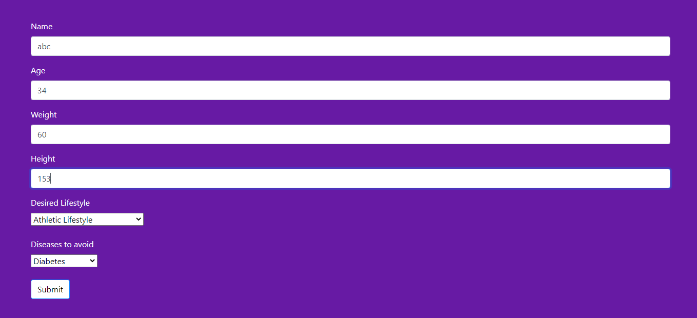
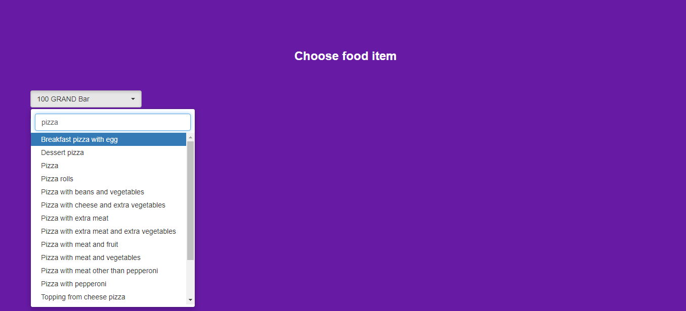
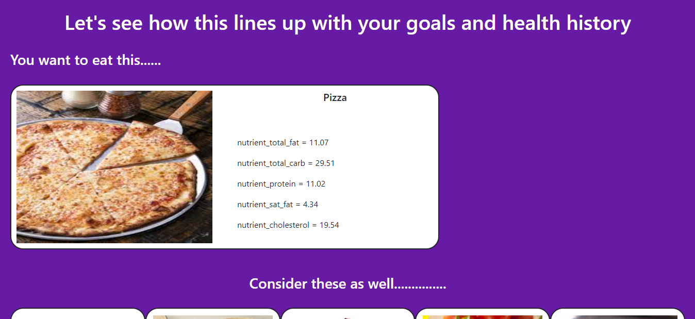
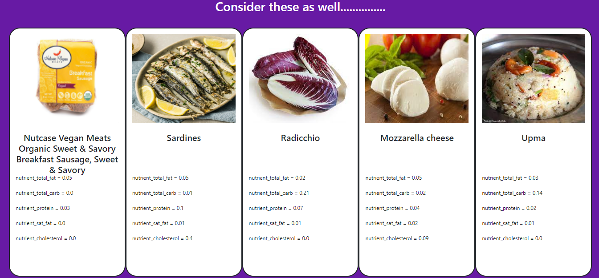
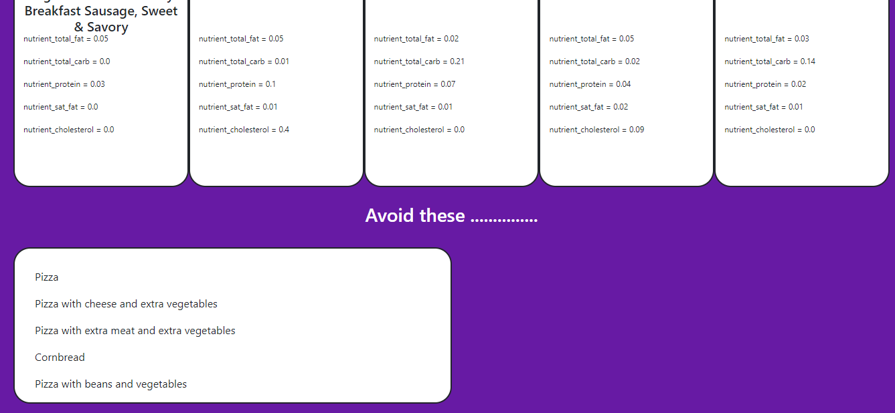

# mindspark-2-team-tars

### Folder: web_app
Function: Flask Web App

### File: cluster.py
Input: result.csv (Food Nutition Dataset)
Output: clustered_data.csv (Clustered Food Items using KMeans)

### File: disease_food_recommendation.ipynb
Input: desired_food, health_condition
Output: Food recommendations and List of foods to avoid

### File: preprocess.py
Function: Combining and Preprocessing data from sources online. (https://www.ewg.org/foodscores/#, https://corgis-edu.github.io/corgis/csv/food/)

### File: scrape.py
Function: Scraping data from the online sources mentioned above and organising them into desired format 
